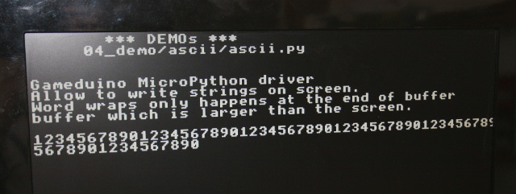
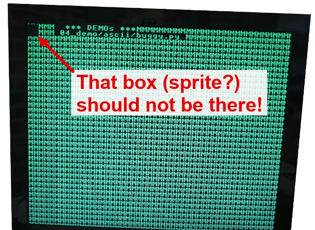
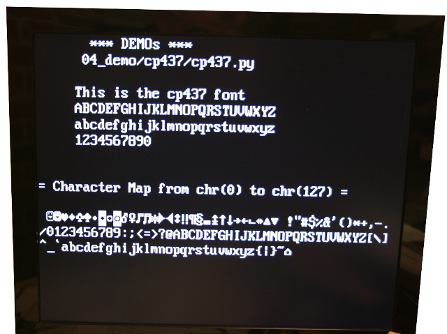

[This file also exists here en ENGLISH](README_eng.md)

* ascii : permet d'afficher du texte (font 8x8 pixels) sur un écran 36 lignes x 47 colonnes.
* cp437 : permet d'afficher du texte (font 16x8 pixels, hauteur x largeur) sur un écran 18 lignes x 47 colonnes.

# Exemples ASCII

Ces exemples concernent principalement l'affichage de texte sur l'écran. Il s'agit surtout du résultat attendu du MOD-VGA pour pouvoir l'utiliser avec une carte MicroPython Pyboard.

## ascii/ascii.py
Explique comment utiliser la fonctionnalité ASCII du MODVGA pour afficher du texte sur l'écran.

Le code est vraiment simple.



## ascii/bug.py



Il reste quelque-chose de visible en haut à droite (un sprite?) en haut à droite.

## ascii/dump.py
Fait un "dump" de la RAM_CHR où est stocké la définition des caractères (également des blocs 8x8 pixels lorsque des scène de jeu sont affichées)

Voici une partie du résultat affiché dans la session REPL.
```
--( 48)--------------------
4864 : 0b....11111111....
4866 : 0b..1111....1111..
4868 : 0b..1111..111111..
4870 : 0b..111111111111..
4872 : 0b..111111..1111..
4874 : 0b..1111....1111..
4876 : 0b....11111111....
4878 : 0b................
--( 49)--------------------
4880 : 0b......1111......
4882 : 0b....111111......
4884 : 0b......1111......
4886 : 0b......1111......
4888 : 0b......1111......
4890 : 0b......1111......
4892 : 0b..111111111111..
4894 : 0b................
--( 50)--------------------
4896 : 0b....11111111....
4898 : 0b..1111....1111..
4900 : 0b..........1111..
4902 : 0b........1111....
4904 : 0b......1111......
4906 : 0b....1111........
4908 : 0b..111111111111..
4910 : 0b................
--( 51)--------------------
4912 : 0b....11111111....
4914 : 0b..1111....1111..
4916 : 0b..........1111..
4918 : 0b......111111....
4920 : 0b..........1111..
4922 : 0b..1111....1111..
4924 : 0b....11111111....
4926 : 0b................
```

# Exemples CodePage

## cp437/cp437.py
Explique comment utiliser le code page personnalisé cp437 (font 16 x 8 pixels) avec le MODVGA pour afficher du texte sur l'écran.

Comme cette approche utilise une méthode de stockage différente pour stocker la définition des caractères (en effet, ascii utilise 8x8 pixels), le script `cp437.py` expose deux autres fonctions nommée `drawstr()` & `atxy()` pour afficher du texte.


